# Mermaid Diagrams for UBI White Paper 2035

## 1. Executive Summary - Overall System Architecture

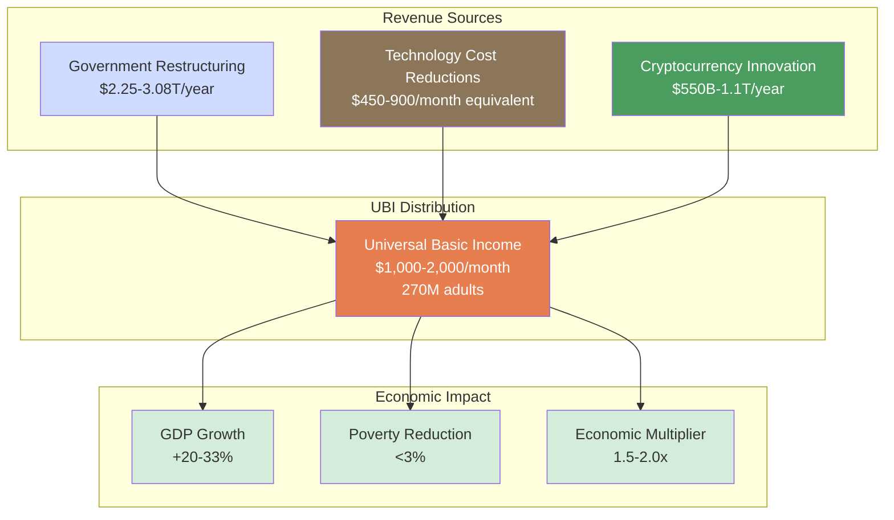

---

## 2. Section 3 - Technology Revolution Components

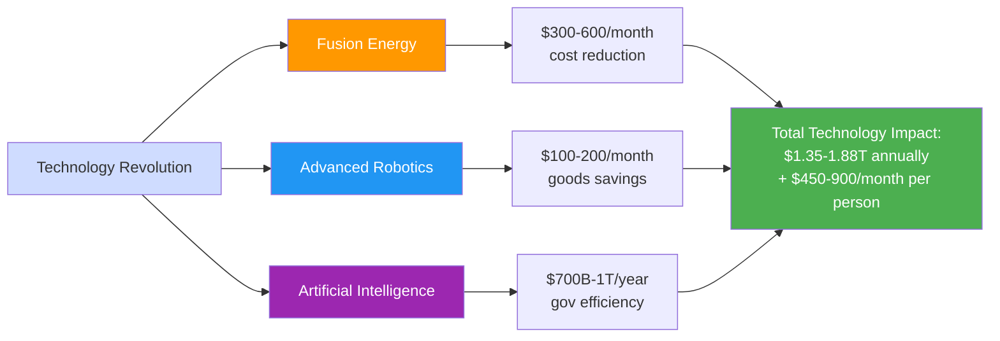

---

## 3. Section 4 - Government Restructuring Breakdown

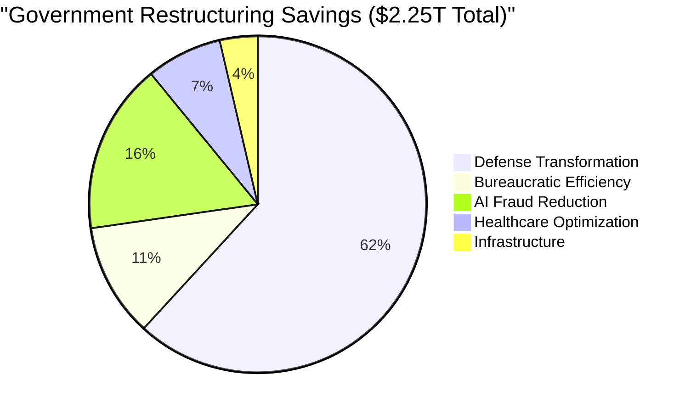

---

## 4. Section 5 - Cryptocurrency Revenue Sources

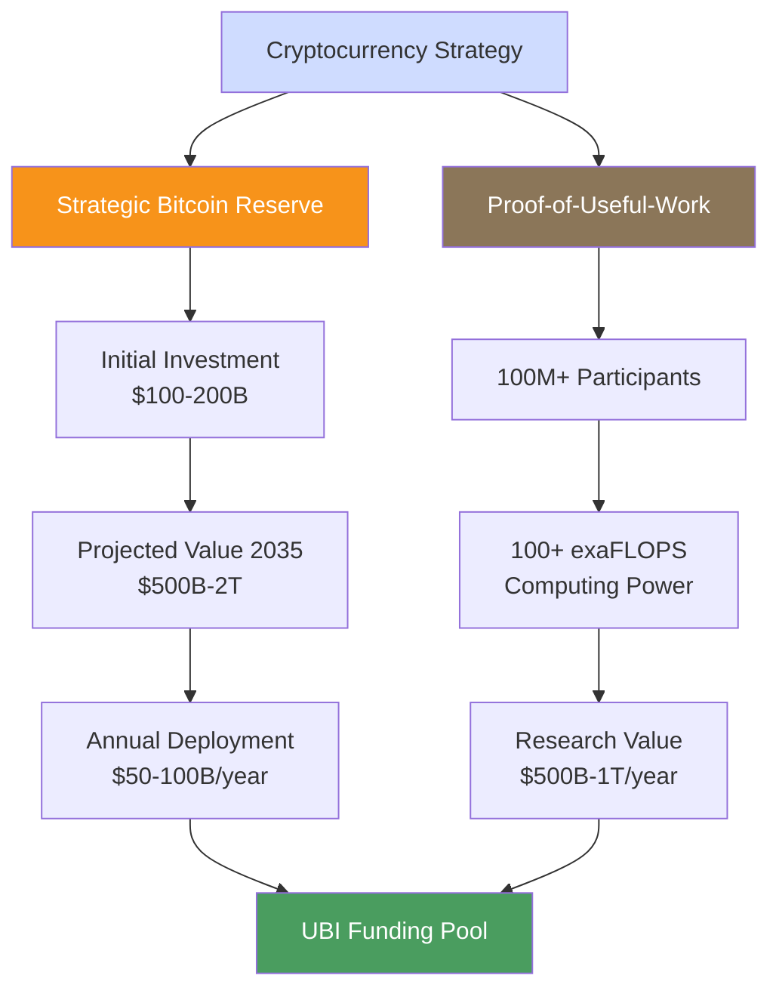

---

## 5. Section 6 - Financial Modeling Timeline

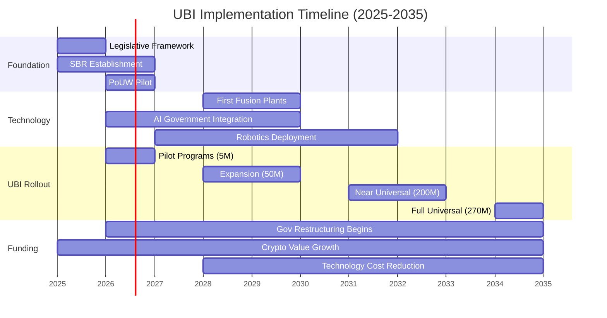

---

## 6. Section 7 - Budget Comparison 2024 vs 2035

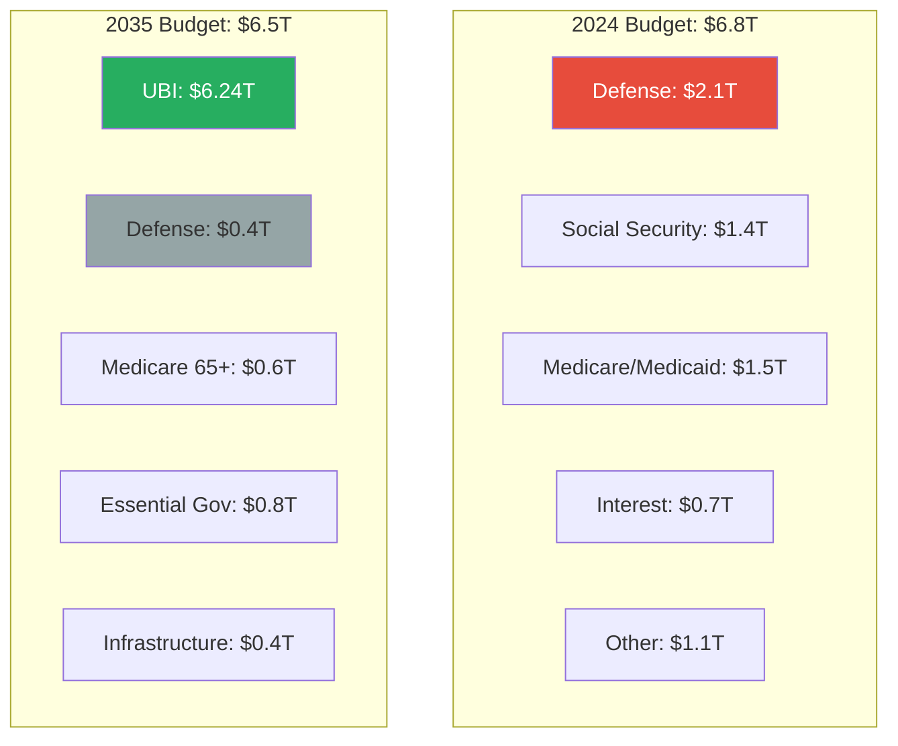

---

## 7. Section 8 - Economic Impact Web

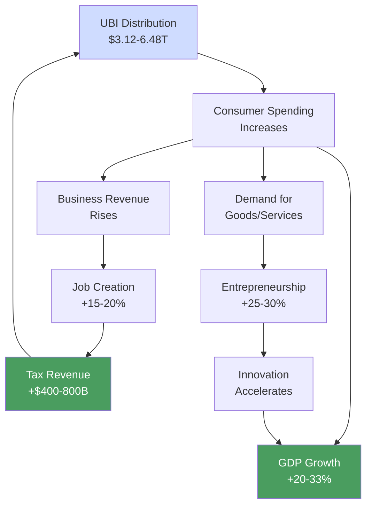

---

## 8. Section 9 - Inflation vs Deflation Balance

```mermaid
graph LR
    subgraph "Inflationary Pressures"
        A1[UBI Cash Injection<br/>$3-6T]
        A2[Increased Demand]
        A3[Money Velocity]
    end

    subgraph "Deflationary Forces"
        B1[Fusion Energy<br/>-30-50% costs]
        B2[Robotics Manufacturing<br/>-20-30% costs]
        B3[AI Services<br/>-15-25% costs]
        B4[Increased Supply]
    end

    A1 --> C[Net Effect]
    A2 --> C
    A3 --> C
    B1 --> C
    B2 --> C
    B3 --> C
    B4 --> C

    C --> D[Annual Inflation:<br/>2-4% Normal Range]

    style A1 fill:#e74c3c,color:#fff
    style A2 fill:#e74c3c,color:#fff
    style A3 fill:#e74c3c,color:#fff
    style B1 fill:#27ae60,color:#fff
    style B2 fill:#27ae60,color:#fff
    style B3 fill:#27ae60,color:#fff
    style B4 fill:#27ae60,color:#fff
    style D fill:#3498db,color:#fff
```

---

## 9. Section 10 - Policy Implementation Flow

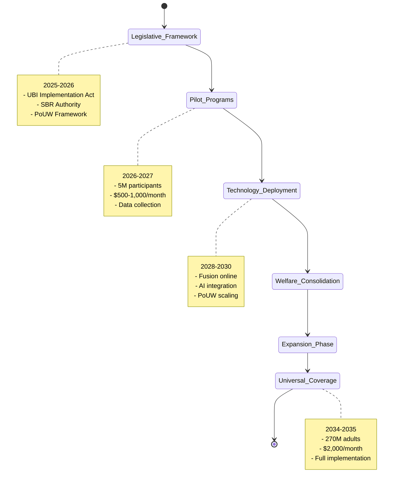

---

## 10. Defense Transformation Savings

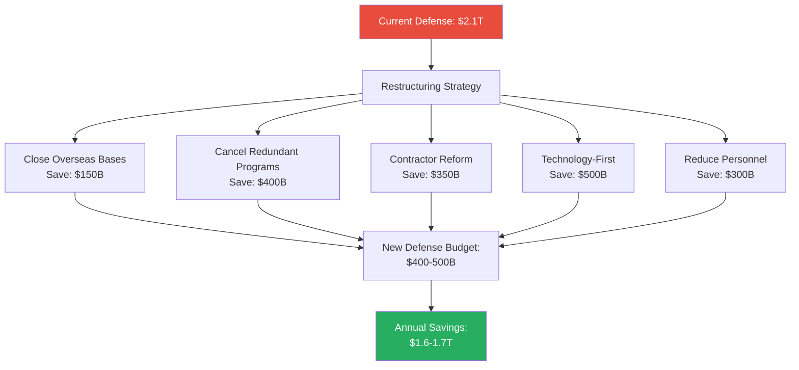

---

## 11. Proof-of-Useful-Work Value Chain

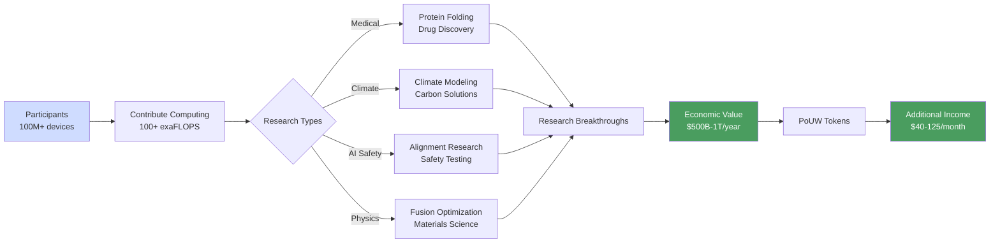

---

## 12. UBI Recipient Income Breakdown

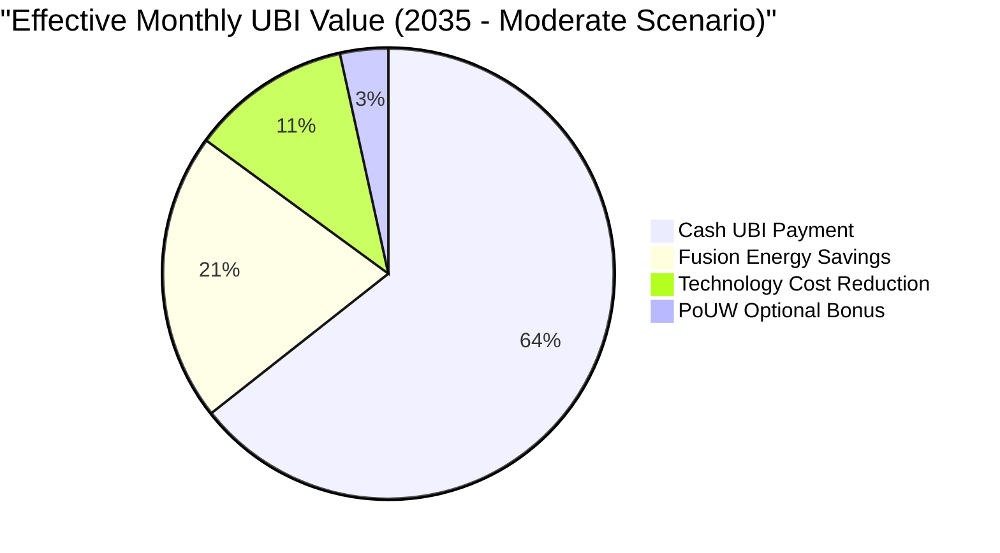

---

## 13. Poverty Reduction Impact

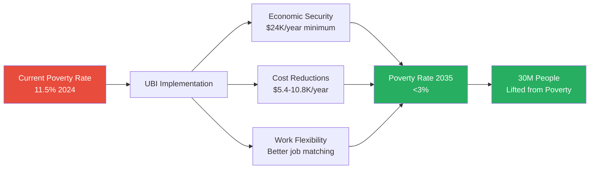

---

## 14. Strategic Bitcoin Reserve Growth Scenarios

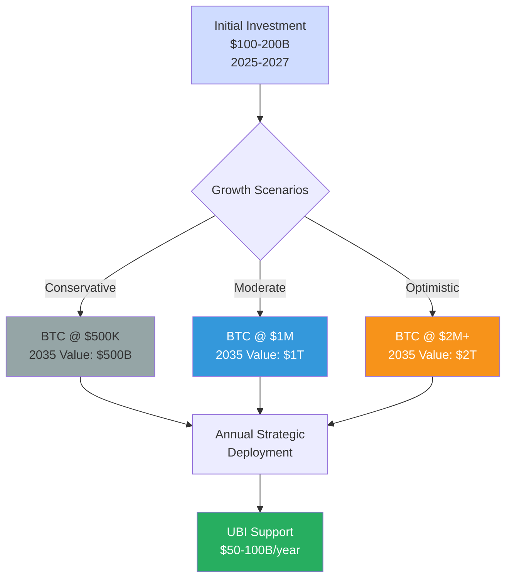

---

## 15. Complete Revenue and Expenditure Flow

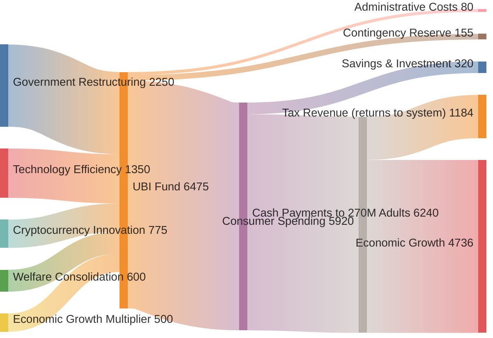

---

## Implementation Notes for White Paper

### Placement Strategy:
1. **Executive Summary**: Diagram #1 (Overall System)
2. **Section 3**: Diagrams #2 (Tech Revolution)
3. **Section 4**: Diagrams #3, #10 (Gov Restructuring)
4. **Section 5**: Diagrams #4, #11, #14 (Cryptocurrency)
5. **Section 6**: Diagram #5 (Timeline), #6 (Budget Comparison)
6. **Section 8**: Diagrams #7, #8 (Economic Impact)
7. **Section 9**: Diagram #9 (Inflation), #13 (Poverty)
8. **Section 10**: Diagram #10 (Policy Flow)
9. **Appendix**: Diagram #15 (Complete Flow - full page)

### Styling for PDF:
- Use color-blind friendly palette
- Ensure grayscale readability (for printing)
- High contrast borders
- Clear, large fonts (minimum 10pt)
- Professional business aesthetic

### Mermaid to PDF Conversion:
1. Use mermaid-cli or online converter
2. Export as SVG first for quality
3. Convert SVG to high-res PNG (300 DPI)
4. Embed in PDF with proper sizing
5. Add figure captions and numbers

### Alternative Tools:
If Mermaid doesn't render well in PDF:
- **Lucidchart**: Professional diagrams
- **Draw.io / diagrams.net**: Free alternative
- **Microsoft Visio**: Enterprise standard
- **D3.js**: Custom interactive (web version only)

### Color Palette for Diagrams:
- **Primary Blue**: #cfdcff (Technology, Systems)
- **Gold**: #f7931a (Bitcoin, Value)
- **Green**: #27ae60 (Positive outcomes, Growth)
- **Red**: #e74c3c (Problems, Old system)
- **Gray**: #95a5a6 (Neutral, Infrastructure)
- **Purple**: #9c27b0 (AI, Advanced tech)
- **Orange**: #ff9800 (Energy, Fusion)
